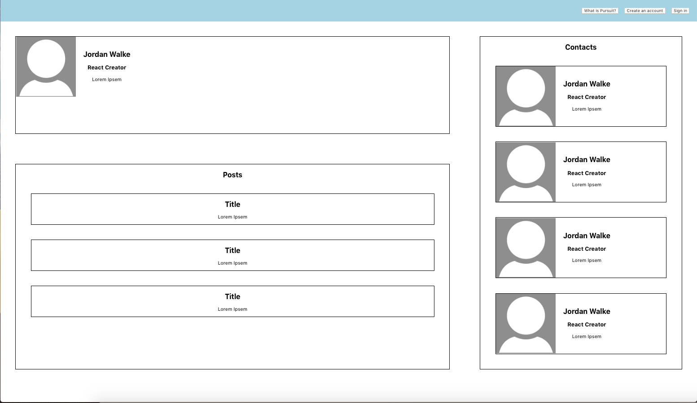
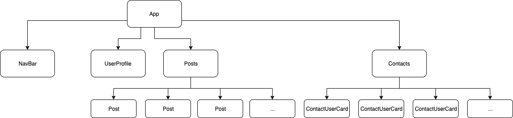
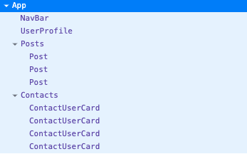

# React Introduction Lab

Edit multiple JavaScript files in this lab as you get the hang of creating and using components.

---

## Lab Setup

### Getting started

1. Fork and clone this repository.

1. Navigate to the cloned repository's directory on your command line. Then, run the following command:

   ```
   npm install
   ```

   This will install the libraries needed.

1. Open up the repository in VSCode. Follow the instructions below to complete the Lab.

1. Deploy this application to Netlify and add the link to your netlify site below:

- [MY LIVE SITE URL]()

## Instructions

You will be building a static React Application that will show some blog posts and user information. It should look similar to the image below. Note: this view has been lightly styled to help provide clarity between components, you do not need to style this app the same way.



Rather than building on large HTML file, you will break up this view into multiple React components. You will create each component in its own file, export it, then import it into `App.js`, then you will structure the components to match the hierarchy listed below.

You are given a number of blank files inside of `src/Components`, which will help guide you in figuring out what components you will need, along with the unit tests.

Connect all of the components inside of the `Components/` directory so that each component shows up on the page.

Your application should have the following component structure:



The component tree above can also be shown as a list:



If you have time, build out the page to be more detailed and styled, like the following mockup image.


